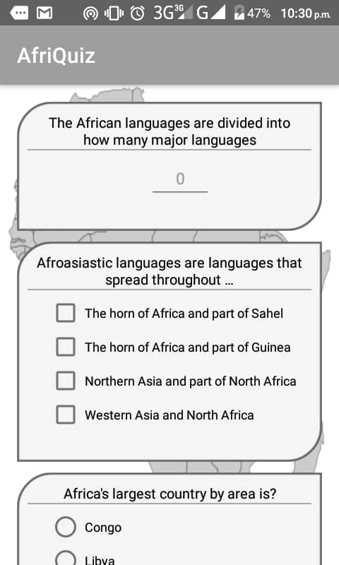
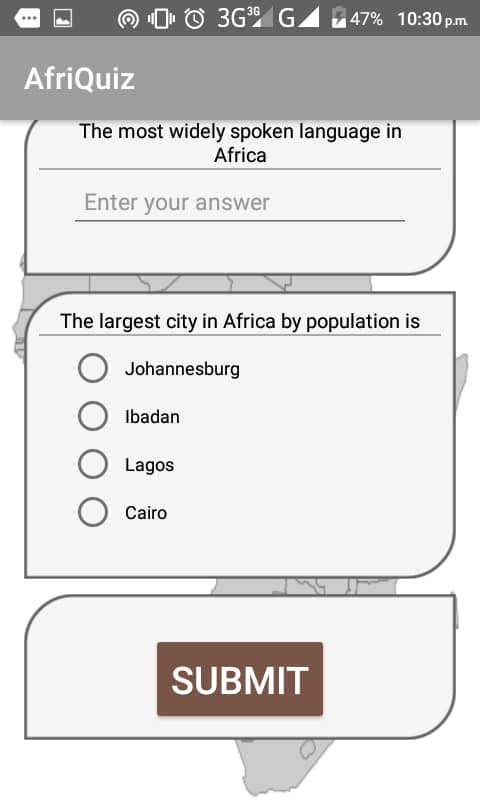

<h1 style="text-align: center;">AfriQuizProject</h1>

<h2>AfriQuiz Project App</h2>

<h3>App Description</h3>

This andriod application quizzes a user about <strong><em>Africa</em></strong>.
  The app has three input mode for question answered which is the
 <ul>
  <li>radio button (for questions with a single right answer), </li>
  <li> check box (for questions with multiple right answers) and </li>
  <li> text entry (for question with free text answers) .</li>
  </ul>

The App includes a submit button for the user to submit their answers and receive a score in percentage.
Pass mark is 70%.

ScreenShot of Quiz App
-------------------------
<table>
    <tr>
        <td>
            
        </td>
        <td>
            
        </td>
    </tr>
</table>

Google Drive App Apk Download Link: copy and paste this link (https://drive.google.com/open?id=1WlYjSRKna07Xlt9R0jLQIaDjsb19u8U1) or click on the link below:
------------------------------------------------------------------------------------------------------------------------------
## [Click Here](https://drive.google.com/open?id=1WlYjSRKna07Xlt9R0jLQIaDjsb19u8U1) to dowload the app.

## Tags
----------
#Andela #7DaysofCodeChallenge #Udacity #GoogleAfricaChallengeScholarship #ALC3.0 

